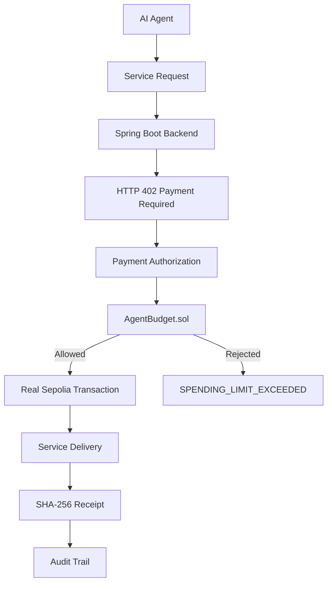
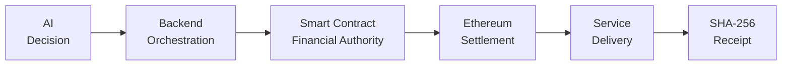
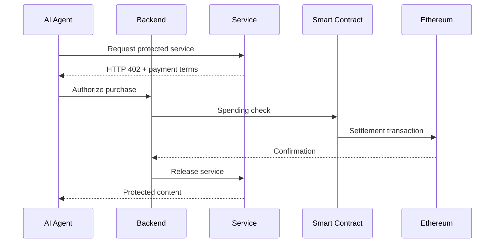

<div align="center">

# 🛡️ AgentPay

### **Autonomous AI Agents. Real Payments. Hard Spending Boundaries.**

**W3A-1 Hackathon — Let AI Agents Buy Services Safely**

<br/>


<br/>

> **AI decides what to buy.
> Backend orchestrates the payment.
> Solidity controls the money.
> Ethereum proves the settlement.**

<br/>

</div>

---

## ⚡ What is AgentPay?

AgentPay is a secure purchasing gateway for autonomous AI agents.

The agent can:

✅ evaluate services
✅ compare providers
✅ request a service
✅ initiate a purchase

But the agent **cannot decide its own financial authority**.

That authority is enforced outside the AI through a deterministic payment layer and an **Ethereum Sepolia smart contract**.

---

## 🎬 See AgentPay in Action

<div align="center">

<!-- Add your real screen-recording GIF here -->


### ₹300 succeeds → ₹700 remains → replay costs ₹0 → ₹800 attack gets BLOCKED

</div>

> **Tip:** Record a 15–25 second screen capture showing the real website, HTTP 402, payment, remaining budget, retry, and blocked overspend. Export it as `docs/assets/agentpay-demo.gif`.

---

# 🚨 The Problem

Traditional autonomous-agent demos often rely on instructions such as:

> “You have a ₹1,000 budget. Please don't spend more.”

But a prompt is not a security boundary.

An AI can:

* hallucinate
* receive malicious instructions
* be affected by prompt injection
* make an incorrect financial decision
* request an amount outside the intended policy

So the real question is:

> **Who actually controls the money?**

---

# 💡 Our Solution

AgentPay separates **AI intelligence** from **financial authority**.



### The security principle

> **The AI may request spending, but it does not control the spending boundary.**

---

# 🔥 The Judge-Proof Security Demo

## Starting State

<div align="center">

|   Budget   |  Spent |  Remaining |
| :--------: | :----: | :--------: |
| **₹1,000** | **₹0** | **₹1,000** |

</div>

---

## 🟢 Step 1 — Valid ₹300 Purchase

The agent requests:

```text
Fast Neural Translation
₹300
```

The protected resource first responds with:

```text
HTTP 402 Payment Required
```

After authorization:

```text
₹300 payment
        ↓
Ethereum Sepolia
        ↓
Transaction confirmed
        ↓
Service delivered
```

New state:

```text
Budget      ₹1,000
Spent         ₹300
Remaining     ₹700
```

---

## 🔁 Step 2 — Replay Attack

The exact same `requestId` is submitted again.

```text
Same request
     ↓
Already processed
     ↓
Existing purchase returned
     ↓
Additional charge = ₹0
```

✅ No double spending.

---

## 🔴 Step 3 — Overspend Attack

Now only ₹700 remains.

The agent requests:

```text
₹800
```

The smart contract evaluates the spending boundary:

```text
₹800 > ₹700
```

Result:

```text
SPENDING_LIMIT_EXCEEDED
```

### Final result

| Property          | Result                      |
| ----------------- | --------------------------- |
| Additional charge | **₹0**                      |
| Budget mutation   | **None**                    |
| Service delivered | **No**                      |
| Audit event       | **OVERSPEND_BLOCKED**       |
| Enforcement layer | **Solidity Smart Contract** |

> **The UI is not pretending to block the attack. The financial boundary itself rejects it.**

---

# 🧠 Why This Architecture Matters



### AI

Can:

* evaluate
* select
* request

Cannot:

* change the budget
* bypass the spending limit
* access the signing key
* approve an overspend

### Backend

Handles:

* service catalog
* authoritative prices
* HTTP 402
* payment orchestration
* idempotency
* audit
* receipt generation

### Blockchain

Enforces:

* budget
* spending
* settlement
* rejection of overspending

---

# ⛓️ Blockchain Layer

| Component          | Implementation                               |
| ------------------ | -------------------------------------------- |
| Network            | Ethereum Sepolia                             |
| Chain ID           | `11155111`                                   |
| Contract           | `AgentBudget.sol`                            |
| Contract Address   | `0xb36c012681cd39De1df076e359E22ba2237A56d6` |
| Blockchain Library | Web3j                                        |
| RPC                | Alchemy Sepolia                              |
| Currency           | INR                                          |
| Accounting         | Integer paise                                |

### Integer-based money

```text
₹1       = 100 paise
₹300     = 30,000 paise
₹800     = 80,000 paise
₹1,000   = 100,000 paise
```

No floating-point money calculations.

---

# 💳 HTTP 402 Flow



---

# 🔐 Receipt Integrity

Payment proves that the transaction happened.

SHA-256 proves that the **delivered content has not been altered**.

```text
Delivered Content
       ↓
     SHA-256
       ↓
Stored Receipt Hash
```

### Original content

```text
Calculated Hash
       =
Stored Hash

✅ VERIFIED
```

### Modified content

```text
Calculated Hash
       ≠
Stored Hash

❌ FAILED
```

The system records:

```text
RECEIPT_TAMPER_DETECTED
```

---

# 🤖 AI Layer

AgentPay uses the project's actual Ollama integration with:

```text
deepseek-r1:7b
```

The AI helps evaluate the purchasing decision.

But:

> **AI reasoning never becomes the financial authority.**

This is intentional.

---

# 🖥️ AgentPay Control Center

The website provides a complete control plane:

### 🎛️ Control Plane

* Overview
* Agents
* Providers
* Wallet & Budget

### ⚙️ Operations

* Payments
* Security Center
* Audit Trail

### 🧪 Demo & Tools

* Attack Simulator
* Judge Mode
* Settings

---

# 📊 Live Dashboard

The Overview screen shows:

```text
┌─────────────────────────────────────┐
│        AGENTPAY CONTROL PLANE       │
├─────────────────────────────────────┤
│ Budget       ₹1,000                 │
│ Spent          ₹300                 │
│ Remaining      ₹700                 │
│                                     │
│ Network      Ethereum Sepolia       │
│ Enforcement  Solidity Contract      │
│ AI Engine    deepseek-r1:7b         │
└─────────────────────────────────────┘
```

---

# 🛡️ Security Features

| Security           | Protection                    |
| ------------------ | ----------------------------- |
| Spending Limit     | Solidity Smart Contract       |
| Replay             | Request ID Idempotency        |
| Double Click       | Frontend + Backend Guards     |
| Price Manipulation | Backend Authoritative Pricing |
| Early Delivery     | Payment-Gated Service         |
| Receipt Tampering  | SHA-256                       |
| Blockchain Proof   | Sepolia Transaction           |
| Auditability       | Structured Audit Trail        |

---

# 🧪 Tested Attack Scenarios

AgentPay has been tested against:

```text
✅ Overspending
✅ Replay / duplicate requests
✅ Concurrent duplicate payments
✅ Price manipulation
✅ Prompt injection
✅ Service-before-payment
✅ Receipt tampering
✅ Invalid API requests
✅ Refresh / recovery
```

---

# 🧑‍⚖️ Judge Mode

AgentPay includes a guided demonstration mode.

### Step 1

**₹300 Normal Purchase**

### Step 2

**Replay / Idempotency**

### Step 3

**₹800 Overspend Attack**

The entire security story can be demonstrated directly from the website.

---

# 🧰 Technology Stack

### Frontend

* Next.js
* React
* TypeScript
* Tailwind CSS
* Lucide React
* Base UI

### Backend

* Java
* Spring Boot
* Spring Web
* Spring Data JPA
* Hibernate
* Jakarta Validation
* Maven

### Blockchain

* Solidity
* OpenZeppelin
* Web3j
* Ethereum Sepolia

### AI

* Ollama
* deepseek-r1:7b
* deterministic fallback

### Database

* H2 In-Memory
* `data.sql`

### Infrastructure

* Docker
* Docker Compose

### Testing

* JUnit 5
* MockMvc
* AssertJ
* Spring Boot Test

---

# 🚀 Run Locally

## Backend

```bash
cd backend
mvn spring-boot:run
```

Backend:

```text
http://localhost:8080
```

## Frontend

```bash
npm install
npm run dev
```

Frontend:

```text
http://localhost:3000
```

---

# 🐳 Docker

```bash
docker compose up --build
```

---

# 🔐 Environment Variables

For real Sepolia mode:

```env
BLOCKCHAIN_MODE=SEPOLIA
SEPOLIA_RPC_URL=<your-rpc-url>
WEB3_PRIVATE_KEY=<your-private-key>
CONTRACT_ADDRESS=<contract-address>
CHAIN_ID=11155111
```

⚠️ **Never commit real secrets to GitHub.**

Use placeholders in `.env.example`.

---

# 🔎 Verify the Blockchain Transaction

Successful transactions can be independently checked on:

**Sepolia Etherscan**

```text
https://sepolia.etherscan.io/
```

This allows a judge to independently verify that the settlement actually happened on Ethereum Sepolia.

---

# 🏆 Why AgentPay?

AgentPay is not simply:

> AI + Wallet + Blockchain

It is:

```text
AI Autonomy
      +
Deterministic Policy
      +
Smart-Contract Enforcement
      +
Real Blockchain Settlement
      +
Cryptographic Delivery Proof
```

The result is:

> **Autonomous purchasing without giving AI unrestricted financial authority.**

---

# 🎯 The Entire Project in One Sentence

> **A ₹300 purchase succeeds, replaying it costs ₹0, and an ₹800 purchase is rejected when only ₹700 remains — by the smart-contract spending boundary.**

---

<div align="center">

## 🛡️ AgentPay

### **Let AI agents buy services — safely.**

Built for the **W3A-1 Hackathon**

⭐ Star the repository if you like the idea.

</div>
